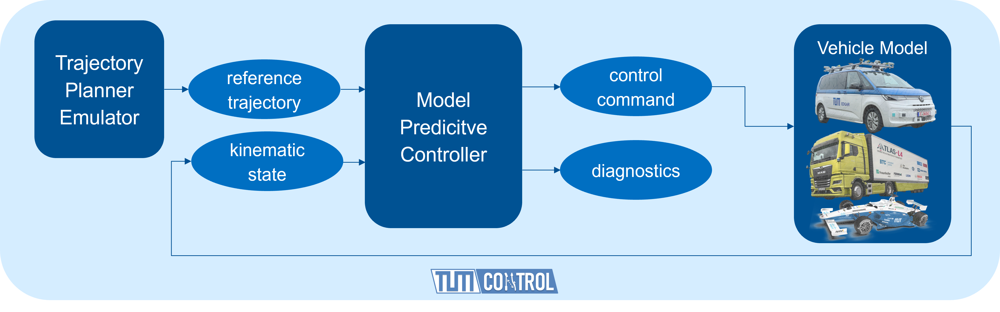

# TUM-CONTROL
A modular simulation framework for Python ultra-rapid prototyping of self-adaptive, stochastic and robust Nonlinear Model Predictive Control (NMPC) for Autonomous Vehicle Motion Control developed by the TUM CONTROL Team of the Autonomous Vehicle Systems Lab (AVS) at TUM.
<p align="center">

</p>

## NMPCs for motion control
The TUM Motion Control simulation framework includes the following base NMPC motion controller:
- Nominal NMPC​
- Stochastic NMPC (SNMPC)​
- Reduced Robustified NMPC (R²NMPC) (coming-soon)

SNMPC in action on Monteblaco Racetrack:

<p align="center">

</p>

Each NMPC has the following characteristics:
- Combined lateral- & longitudinal motion control for trajectory following​
- Dynamic nonlinear single track prediction model with Pacejka tire model in CasADi
- Nonlinear constraints:​
  - Combined lateral- & longitudinal ​acceleration limits​
  - Actuator limits
  
## Architecture
<p align="center">

</p>

The TUM Control simulation framework includes:
- Trajectory Planner emulator that contains a catalog of challenging trajectories 
- Vehicle dynamics model: currenty a nonlinear single track prediction model with Pacejka tire, currently parametrized and validated using real-world data on a Volkswagen T7 (EDGAR). TODO: 
- 2D live track & vehicle motion visualization
- Closed-loop Performance analysis & MPC Debugging
- MPC experiments benchmarking

## Advantages 
- Capability to isolate the controller from the rest of the software and thus guarantee a static environment for rapid prototyping
- Automatic C++ Code Generation with ACADOS
- Developed packages can easily be integrated into the rest of the software stack for autonomous driving or Hardware-in-the-Loop simulations as well as be deployed on the vehicle.

## Installation
Tested on:
- Ubuntu 20.04 LTS 
- Ubuntu 22.04 LTS
- Mac OSX Ventura 13.01
Python version should be at least 3.7 and at last 3.9

Compile and install ACADOS by following: 
- https://docs.acados.org/installation/index.html 

We recommend you to create a new python virtual environment. Example with Python 3.9:
- create virtual environment:
```bash
sudo apt install python3.9-venv
python3.9 -m venv <Path>/tum-control-venv
```
- activate the virtual environment
```bash 
source <Path>/tum-control-venv/bin/activate
```
- clone this repository
```bash
git clone git@gitlab.lrz.de:bzarr/tum-control.git
```
- install missing packages using pip requirements.txt
```bash 
pip install -r tum-control/Python/requirements.txt 
```
- Link ACAODS Python Interface
```bash 
pip install -e <acados_root>/interfaces/acados_template
```
- Don't forget to add the path to the compiled shared libraries and to source ACADOS (https://docs.acados.org/python_interface/index.html):
```bash
export LD_LIBRARY_PATH=$LD_LIBRARY_PATH:"<acados_root>/lib"
export ACADOS_SOURCE_DIR="<acados_root>"
```
Example:
```bash
export LD_LIBRARY_PATH=$LD_LIBRARY_PATH:"/home/alienware2/acados/lib"
export ACADOS_SOURCE_DIR="/home/alienware2/acados"
```
- It may occur that you need to install tkinter for the matplotlib animation. 
```bash
sudo apt install python3-tk
```
## Usage
To start the simulation, run the main file "main.py"

Simulation parameters are in Config/sim_main_params.yaml
| simulation mode| description|
| ---| --- |
| 0| CiL (Controller-Vehicle in Loop): simulation model= separate vehicle dynamics model|
| 1| MPC Sim (MPC in Loop): simulation model= MPC predictions |

## Simulation workflow
1. loads MPC parameters from /Config folder
2. loads reference trajectory and track .json file from /Config folder
3. gets the starting index of the vehicle on the trajectory and sets the initial state of the vehicle
4. loads vehicle simulator from /Vehicle_Simulator folder
5. loads MPC ACADOS formulation from /TUM_Motion_Controller folder
6. sets initial MPC state constraint
7. configures live visualization, if the option is set to True
8. starts the simulation loop:
    
    1. gets current reference trajectory from the simple trajectory planner emulator defined in /Utils/MPC_sim_utils.py : TBD: PLANNER EMULATOR FEATURES DESCRIPTION 
    2. updates the MPC reference $y_{ref}$ for all intermediate shooting nodes (1 to N-1) and $y^e_{ref}$ for the terminal shooting node N
    3. solves the MPC problem, gets and logs the solution
    4. extracts current MPC predicitons
    5. extracts and logs solver debugging information
    6. logs current reference
    7. makes one simulation step and updates current vehicle kinematic state
    8. updates initial MPC state constraint
    9. live simulation visualization, if the option is set to True

9. post-processing
10. generates performance analysis plots 

## Credits
The owner of TUM-CONTROL is Baha Zarrouki (baha.zarrouki@tum.de). 
The following students made major contributions to this framework throughout their thesis:
- Joao Nunes (Robust NMPC)
- Chenyang Wang (Stochastic NMPC (SNMPC) and Reinforcement Learning driven adaptive SNMPC (aSNMPC))
- Marios Spanakakis (Safe Reinforcement Learning driven Weights-varying MPC with Pareto-Optimal sets)

## Coming soon
DRL driven adaptive SNMPC

## Papers
## Papers
Zarrouki, Baha, Chenyang Wang, and Johannes Betz. "A stochastic nonlinear model predictive control with an uncertainty propagation horizon for autonomous vehicle motion control." 2024 American Control Conference (ACC). IEEE, 2024. https://ieeexplore.ieee.org/abstract/document/10645032/ 

Zarrouki, Baha, João Nunes, and Johannes Betz. "R²NMPC: A Real-Time Reduced Robustified Nonlinear Model Predictive Control with Ellipsoidal Uncertainty Sets for Autonomous Vehicle Motion Control." IFAC-PapersOnLine 58.18 (2024): 309-316. https://www.sciencedirect.com/science/article/pii/S2405896324014277 

Zarrouki, Baha, Chenyang Wang, and Johannes Betz. "Adaptive stochastic nonlinear model predictive control with look-ahead deep reinforcement learning for autonomous vehicle motion control." 2024 IEEE/RSJ International Conference on Intelligent Robots and Systems (IROS). IEEE, 2024. https://ieeexplore.ieee.org/abstract/document/10801876 

B. Zarrouki, M. Spanakakis and J. Betz, "A Safe Reinforcement Learning driven Weights-varying Model Predictive Control for Autonomous Vehicle Motion Control," 2024 IEEE Intelligent Vehicles Symposium (IV), Jeju Island, Korea, Republic of, 2024, pp. 1401-1408, doi: 10.1109/IV55156.2024.10588747. https://ieeexplore.ieee.org/document/10588747

Zarrouki, Baha, et al. "Weights-varying mpc for autonomous vehicle guidance: a deep reinforcement learning approach." 2021 European Control Conference (ECC). IEEE, 2021. https://ieeexplore.ieee.org/abstract/document/9655042